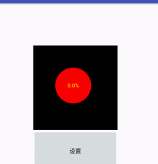

# Android数据饼图


## 效果图



## <a name="1"></a>Attributes属性
|Attributes|format|describe
|---|---|---|
|textSize| dimension |中间文字的大小
|rate| float |中间文字
|circleColor| color |中间圆的颜色
|arcColor| color |外弧的颜色
|textColor| color|中间文字的颜色


## <a name="2"></a>方法
|方法名|描述|版本限制
|---|---|---|
|setRate(float rate)| 设置数据，类型：List<String>|无


## 使用步骤

#### Step 1.下载项目中的circleview library

#### Step 2.在布局文件中添加CircleView，可以设置自定义属性

```xml
<xiaoxing.com.circleview.CircleView
        android:id="@+id/circleview"
        android:layout_width="200dp"
        android:layout_height="200dp"
        app:textColor="#ffe100"
        app:textSize="13sp"
        app:rate="90"
        android:background="#000000"
        android:layout_marginLeft="80dp"
        android:layout_marginTop="100dp"
        android:paddingLeft="10dp"
        android:paddingRight="20dp"
        android:paddingTop="10dp"
        android:paddingBottom="20dp"/>
```
* <a href="#1">点击可参考更多自定义属性</a>

